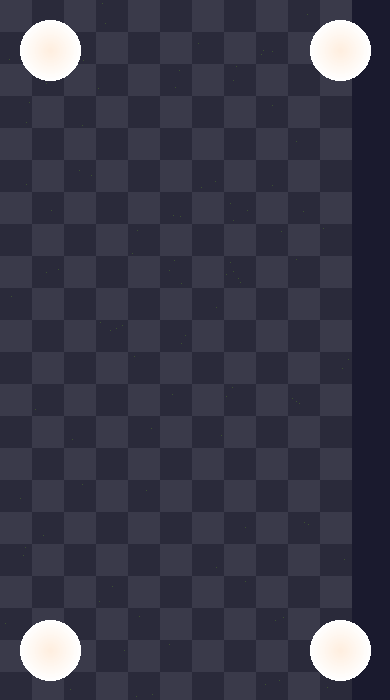
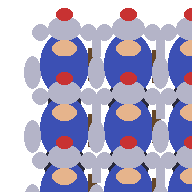
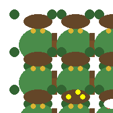

# Pixel Art Benchmark Report

[](https://github.com/daniel-bo/pixel-art-benchmark/actions/workflows/ci.yml) [](https://github.com/daniel-bo/pixel-art-benchmark/actions/workflows/deploy.yml)

This repository contains the outputs from running `pixel-art-benchmark.md` across multiple models and versions.

Each completed run produced the four required assets:

- `background.png`
- `hero-3x3-sheet.png`
- `goblin-3x3-sheet.png`
- `orb-sheet.png`

The sections below compare the generated results visually, grouped by model. The incomplete `minimax` run is called out separately.

## Prompt Used

All model runs used this prompt:

> You are going to create pixel art according to pixel-art-benchmark.md , but you will put all the files in the root of the gpt-5.3-codex-medium/ directory. This is a benchmark.

## Summary

| Model | Status | Assets | Notes |
|---|---:|---:|---|
| Gemini 2.5 Flash | Complete | 4/4 | All benchmark assets present |
| Gemini 2.5 Pro | Complete | 4/4 | All benchmark assets present |
| Gemini 3 Flash | Complete | 4/4 | All benchmark assets present |
| Gemini 3.1 Pro | Complete | 4/4 | All benchmark assets present |
| Haiku 4.6 | Complete | 4/4 | All benchmark assets present |
| GLM 5 | Complete | 4/4 | All benchmark assets present |
| GPT 5.3 Codex Medium | Complete | 4/4 | All benchmark assets present |
| GPT 5.4 Medium | Complete | 4/4 | All benchmark assets present |
| GPT 5.4 Mini Medium | Complete | 4/4 | All benchmark assets present |
| Opus 4.6 | Complete | 4/4 | All benchmark assets present |
| Sonnet 4.6 | Complete | 4/4 | All benchmark assets present |
| Minimax M2.5 | Complete | 4/4 | All benchmark assets present |

### Minimax M2.5

| Background | Hero | Goblin | Orb |
|---|---|---|---|
|  |  |  |  |

## CI/CD

This project uses GitHub Actions for continuous integration and deployment.

### Workflows

- **CI** (`.github/workflows/ci.yml`): Runs on every push and PR to `main`. Executes lint, TypeScript type checking, unit tests, and production build on Node 20 and Node 22.
- **Deploy** (`.github/workflows/deploy.yml`): Runs on every push to `main`. Deploys to GitHub Pages automatically.

### GitHub Pages Deployment

GitHub Pages deployment is automatically configured. The workflow:
1. Builds the static export on every push to `main`
2. Deploys the `out/` directory to GitHub Pages

No secrets are required — deployment uses GitHub's built-in Pages integration.

### Local Development

```bash
bun run dev      # Start dev server
bun run build    # Production build
bun run test     # Run test suite
bun run lint     # Lint code
```
