# Pixel Art Benchmark Report

This repository contains the outputs from running `pixel-art-benchmark.md` across multiple models and versions.

Each completed run produced the four required assets:

- `background.png`
- `hero-3x3-sheet.png`
- `goblin-3x3-sheet.png`
- `orb-sheet.png`

The sections below compare the generated results visually, grouped by model. The incomplete `minimax` run is called out separately.

## Prompt Used

All model runs used this prompt:

> You are going to create pixel art according to pixel-art-benchmark.md , but you will put all the files in the root of the gpt-5.3-codex-medium/ directory. This is a benchmark.

## Summary

| Model | Status | Assets | Notes |
|---|---:|---:|---|
| Gemini 2.5 Flash | Complete | 4/4 | All benchmark assets present |
| Gemini 2.5 Pro | Complete | 4/4 | All benchmark assets present |
| Gemini 3 Flash | Complete | 4/4 | All benchmark assets present |
| Gemini 3.1 Pro | Complete | 4/4 | All benchmark assets present |
| Haiku 4.6 | Complete | 4/4 | All benchmark assets present |
| GLM 5 | Complete | 4/4 | All benchmark assets present |
| GPT 5.3 Codex Medium | Complete | 4/4 | All benchmark assets present |
| GPT 5.4 Medium | Complete | 4/4 | All benchmark assets present |
| GPT 5.4 Mini Medium | Complete | 4/4 | All benchmark assets present |
| Opus 4.6 | Complete | 4/4 | All benchmark assets present |
| Sonnet 4.6 | Complete | 4/4 | All benchmark assets present |
| Minimax M2.5 | Incomplete | 0/4 | Directory contains only `generate_assets.py` |

## Visual Comparison

### Gemini 2.5 Flash

| Background | Hero | Goblin | Orb |
|---|---|---|---|
|  |  |  |  |

### Gemini 2.5 Pro

| Background | Hero | Goblin | Orb |
|---|---|---|---|
| 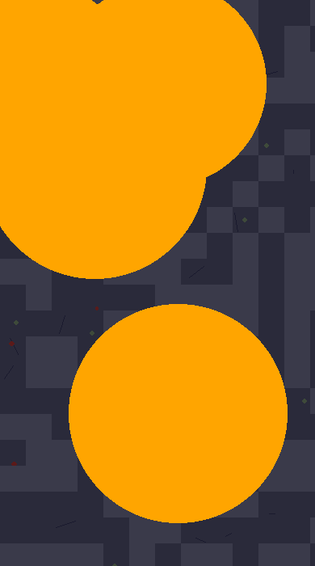 | 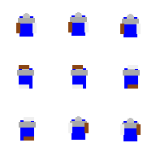 | 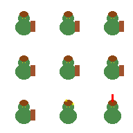 |  |

### Gemini 3 Flash

| Background | Hero | Goblin | Orb |
|---|---|---|---|
| 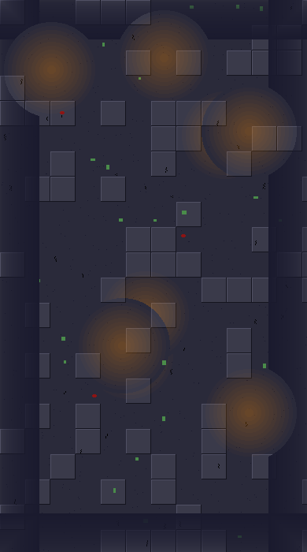 | 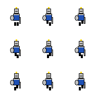 | 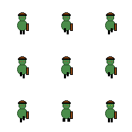 |  |

### Gemini 3.1 Pro

| Background | Hero | Goblin | Orb |
|---|---|---|---|
| 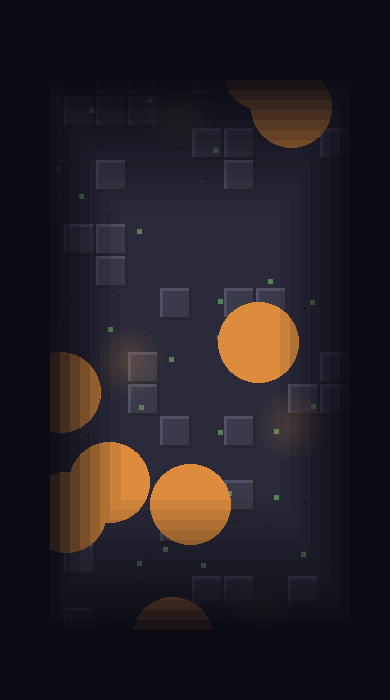 | 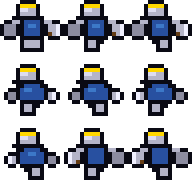 | 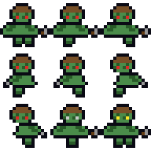 |  |

### Haiku 4.6

| Background | Hero | Goblin | Orb |
|---|---|---|---|
| 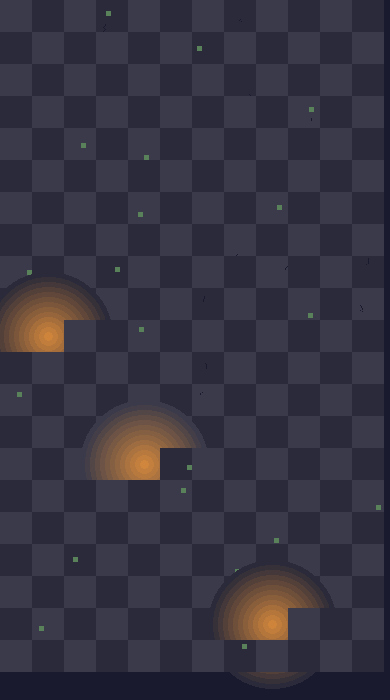 | 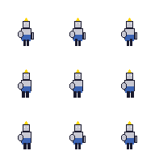 | 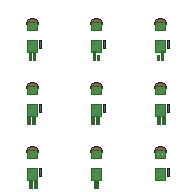 |  |

### GLM 5

| Background | Hero | Goblin | Orb |
|---|---|---|---|
| 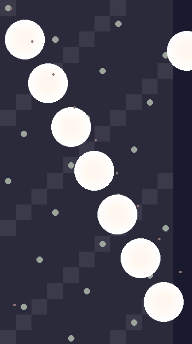 | 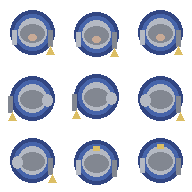 | 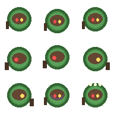 |  |

### GPT 5.3 Codex Medium

| Background | Hero | Goblin | Orb |
|---|---|---|---|
| 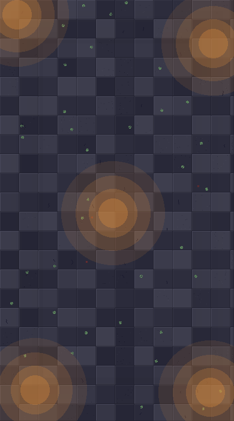 | 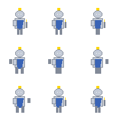 | 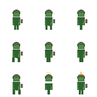 |  |

### GPT 5.4 Medium

| Background | Hero | Goblin | Orb |
|---|---|---|---|
| 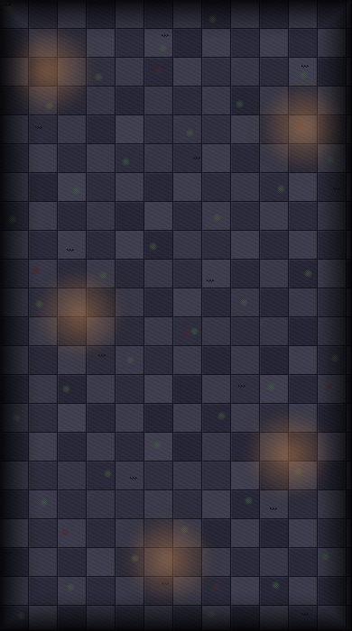 | 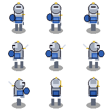 | 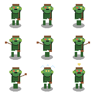 |  |

### GPT 5.4 Mini Medium

| Background | Hero | Goblin | Orb |
|---|---|---|---|
| 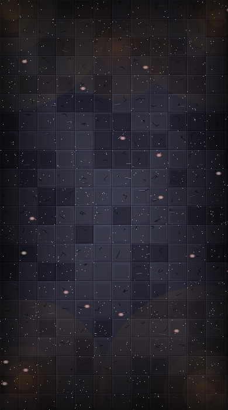 | 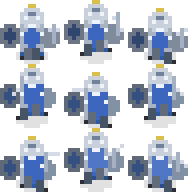 | 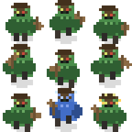 | 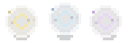 |

### Opus 4.6

| Background | Hero | Goblin | Orb |
|---|---|---|---|
| 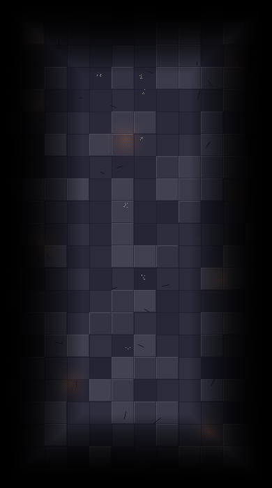 | 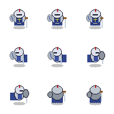 | 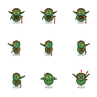 |  |

### Sonnet 4.6

| Background | Hero | Goblin | Orb |
|---|---|---|---|
| 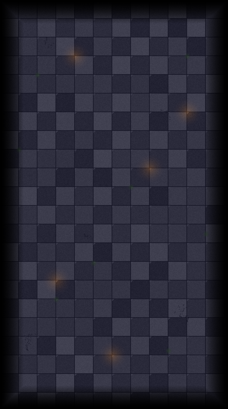 | 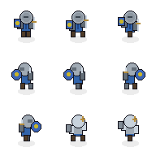 | 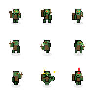 |  |

## Incomplete Run

### Minimax M2.5

The `minimax-m2.5` directory did not complete the benchmark. It contains only the asset-generation script and no generated PNG files, so there is nothing to display for visual comparison.
